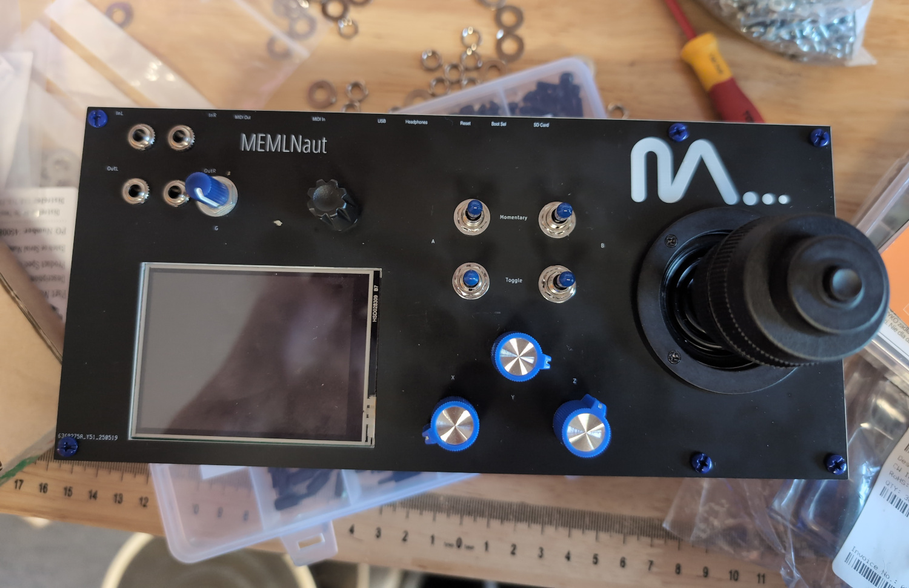

{:class="img-responsive"}

MEMLNaut is a musical instrument and research platform for exploration of musically embodied machine learning.  It can process and generate sound, it's extensible with a wide range of IO and interfaces, and it can optimise and run machine learning models on it's dual core microcontroller chip.

MEMLNAut is open source, you can find all the Kicad files on our github.

